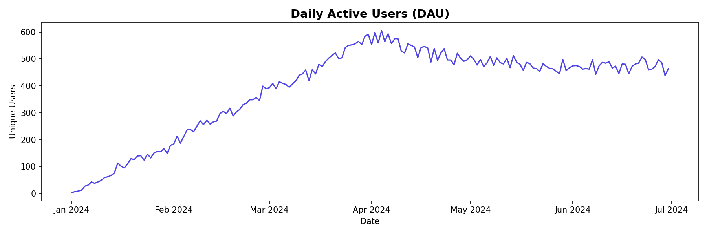
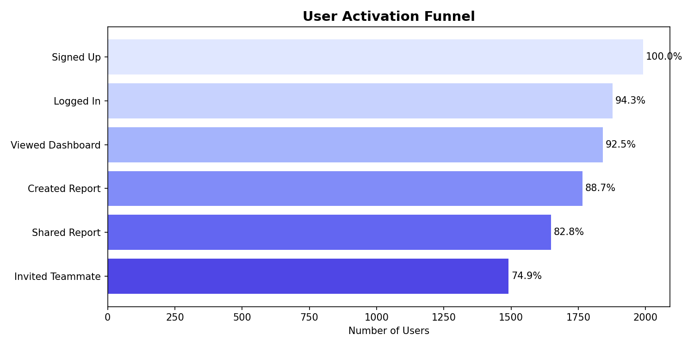
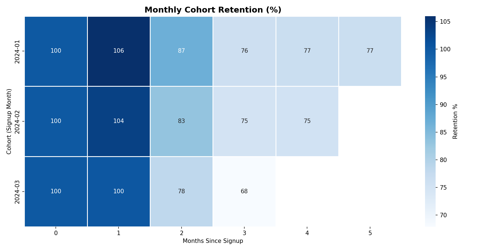
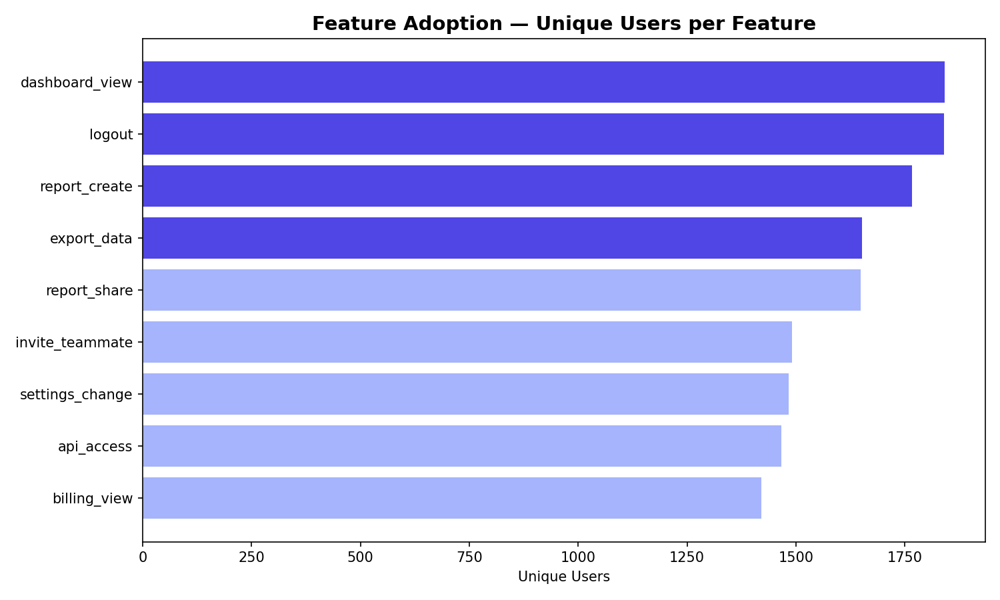

# 📊 SaaS Product Analytics Platform

> **Simulating the analytics function of a B2B SaaS company** — tracking user engagement,
> activation, retention, and feature adoption to drive product growth decisions.

---

## 🎯 Business Context

A B2B SaaS company serving 2,000+ users across Free, Starter, Pro, and Enterprise plans
wants to understand:

- Are users actually **activating** after signup?
- Which **features** drive retention?
- Which **cohorts** are churning — and when?
- What is our **stickiness** compared to industry benchmarks?

This project answers all four questions using realistic event-level data,
mimicking how analysts at companies like Atlassian, Salesforce, and Freshworks work.

---

## 📁 Project Structure
saas-product-analytics/
│
├── data/                    # Generated dataset (saas_events.csv)
├── notebooks/               # Analysis notebooks (run in order)
│   ├── 01_data_generation.ipynb
│   ├── 02_engagement_metrics.ipynb
│   ├── 03_funnel_analysis.ipynb
│   ├── 04_cohort_retention.ipynb
│   └── 05_feature_adoption.ipynb
├── sql/                     # Production-ready SQL queries
│   └── queries.sql
├── images/                  # Charts and visualisations
└── README.md

---

## 🔍 Key Analyses

### 1. Engagement Metrics (DAU / WAU / MAU / Stickiness)
Tracked daily, weekly, and monthly active users.
Calculated **Stickiness ratio (DAU/MAU)** — a key benchmark for product health.
Industry benchmark for good SaaS stickiness: **13–20%**.



---

### 2. User Activation Funnel
Mapped the journey from **Signup → Login → Dashboard → Report Creation → Sharing**.

Key finding: Drop-off between Dashboard View and Report Creation was **~38%**,
suggesting users need better onboarding to reach the core "aha moment."



---

### 3. Cohort Retention Analysis
Built a **monthly cohort retention heatmap** tracking what % of users
from each signup cohort remained active in subsequent months.

Key finding: Month-1 retention averaged **~42%**, dropping to **~28%** by Month-3 —
indicating a need for re-engagement campaigns targeting 30-day inactive users.



---

### 4. Feature Adoption by Plan
Identified which features are used most — and which are underutilised
relative to their strategic value.

Key finding: **API Access** and **Invite Teammate** (high-value viral/expansion features)
had the lowest adoption, pointing to a product education gap.



---

## 💡 Business Recommendations

| # | Finding | Recommendation |
|---|---------|---------------|
| 1 | 38% drop-off before first report creation | Add guided onboarding checklist for new users |
| 2 | Month-3 retention drops to ~28% | Launch automated re-engagement email at Day 25 |
| 3 | API Access underused across all plans | Create in-app tutorial for API feature |
| 4 | Enterprise users 3× more likely to invite teammates | Make invite flow more prominent for Pro users |
| 5 | Stickiness highest in March cohort | Investigate what changed — replicate if product-driven |

---

## 🛠️ Tools & Skills

| Tool | Usage |
|------|-------|
| Python (pandas, numpy) | Data generation, wrangling, analysis |
| Matplotlib / Seaborn | Visualisation |
| SQL | Production-ready metric queries |
| Jupyter Notebook | Analysis documentation |
| GitHub | Version control and portfolio hosting |

**Concepts demonstrated:**
`Product Analytics` · `Cohort Analysis` · `Retention Analysis` · `Funnel Analysis` ·
`Feature Adoption` · `DAU/MAU/Stickiness` · `KPI Definition` · `Business Storytelling`

---

## ▶️ How to Run

```bash
# 1. Clone the repo
git clone https://github.com/YOUR_USERNAME/saas-product-analytics.git
cd saas-product-analytics

# 2. Install dependencies
pip install pandas numpy matplotlib seaborn jupyter

# 3. Run notebooks in order
jupyter notebook
```

Start with `01_data_generation.ipynb` to create the dataset,
then run notebooks `02` through `05` in sequence.

---

## 👩‍💻 About This Project

Built as part of a Senior Data Analyst portfolio targeting
product analytics roles at SaaS companies, unicorn startups, and FAANG.

**Domain:** SaaS / Product Analytics
**Dataset:** Synthetically generated (2,000 users, ~80,000 events, Jan–Jun 2024)
**Analyst:** [Soumili Nag] · [(https://www.linkedin.com/in/soumilinag/)] · [(https://github.com/Mili99-lab)]